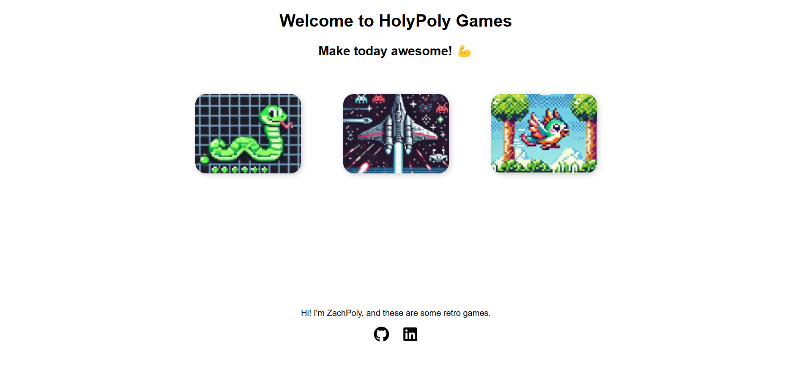

# HolyPoly Games 

Welcome to **HolyPoly Games**! This is a collection of retro-styled web games developed with HTML, CSS, and JavaScript. Navigate through the dashboard to play classic games like Snake, Space Invaders, and Flappy Bird.

## 🌟 Overview
**HolyPoly Games** is a lightweight, browser-based platform for enjoying classic retro games. It's perfect for nostalgia enthusiasts or anyone looking to have some fun with simple yet engaging gameplay. The project is designed with a clean, responsive UI, making it accessible on both desktop and mobile devices.

## 🚀 Features
- **Pixel Snake**: A classic snake game where you grow by eating food.
- **Space Protectors**: Defend your ship from alien invaders!
- **Happy Wings**: Guide your bird through obstacles with precision timing.
- Retro-inspired design.
- Intuitive and responsive user interface.

## 🛠️ Technology Stack
- **HTML5**: For structuring the web pages and game interfaces.
- **CSS3**: For styling, including animations and responsive design.
- **JavaScript (ES6)**: For game logic, interactivity, and dynamic content.
